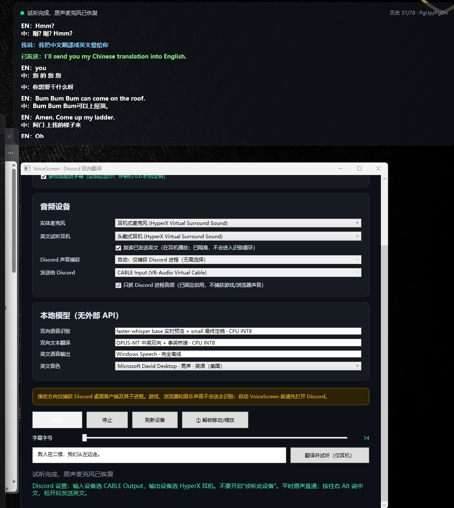

# VoiceScreen 项目说明

VoiceScreen 是一款面向 Windows 11 和 Discord 桌面客户端的本地双向语音翻译工具。它解决的核心问题是：玩游戏并加入 Discord 语音频道时，让中文用户看懂外国玩家的发言，同时把自己说的中文转换成英文语音发送给对方。

项目运行时不依赖讯飞或其他云端 API。语音识别、文本翻译和英文语音合成都在本机完成，默认使用 CPU INT8 推理，避免与 3A 游戏争抢显卡资源。



## 1. 主要功能

- 只捕获 Discord 桌面客户端及其子进程声音，不识别游戏、浏览器、音乐或整个系统的混合声音。
- Discord 对方说英语时，在悬浮窗显示英文原文和中文译文。
- Discord 对方说泰语时，经本地 `泰语 → 英语 → 中文` 模型桥接翻译。
- 检测到中文时直接显示原文，不执行无意义的中文翻译。
- 低延迟模式下边说边显示临时字幕，停顿后再用更准确的模型定稿。
- 平时将实体麦克风原声直通 Discord；按住右 Alt 说中文、松开后发送英文语音。
- 悬浮窗同步显示“我说”的中文和实际发送的英文，方便核对翻译内容。
- 支持 Windows 已安装的英文男声、女声音色。
- 支持仅在耳机中试听翻译结果，不发送给 Discord。
- 支持字幕历史、`PgUp`/`PgDn` 翻页、字号调整、窗口移动和缩放。
- 对重复字符、周期短语和异常膨胀译文进行过滤，减少 Whisper 幻觉污染字幕。
- 合成英文播放期间暂停接收识别并隔离麦克风直通，防止程序听见自己后无限翻译。

## 2. 双向工作流程

### 2.1 对方说话：英语或泰语转中文字幕

```text
Discord 进程音频
    ↓
Windows Process Loopback（只捕获 Discord）
    ↓
faster-whisper base（临时识别）
    ↓
OPUS-MT（增量翻译）
    ↓
悬浮窗临时原文与中文
    ↓
faster-whisper small（停顿后最终定稿）
    ↓
悬浮窗历史字幕
```

低延迟字幕默认开启。临时结果采用灰色独立区域原地更新，不写入历史；最终结果才进入字幕历史。若更重视完整性而不是速度，可以关闭“游戏低延迟字幕”，回到整段语音完成后再识别的稳定模式。

### 2.2 我方说话：中文转英文语音

```text
普通状态：实体麦克风 → VoiceScreen → VB-CABLE → Discord（中文原声）

按住右 Alt：停止原声直通 → 录制中文
松开右 Alt：中文识别 → 中译英 → Windows 英文语音
                            ↓
                    VB-CABLE → Discord
                            ↓（可选）
                         实体耳机
```

右 Alt 是全局按住说话键。程序同时使用 Raw Input、低级键盘钩子和异步键状态轮询，并对重复事件去重，以提高全屏游戏和部分带反作弊游戏中的兼容性。程序不会向游戏注入代码，也不会读取游戏内存。

## 3. 音频设备关系

VoiceScreen 需要 [VB-Audio Virtual Cable](https://vb-audio.com/Cable/) 为翻译后的英文提供一条独立的虚拟麦克风通道。

| 设置位置 | 正确选择 |
|---|---|
| VoiceScreen 实体麦克风 | HyperX 或其他真实麦克风 |
| VoiceScreen 英文试听耳机 | HyperX 或其他实体耳机 |
| VoiceScreen 发送给 Discord | `CABLE Input (VB-Audio Virtual Cable)` |
| Discord 输入设备 | `CABLE Output (VB-Audio Virtual Cable)` |
| Discord 输出设备 | HyperX 或其他实体耳机 |

不要把 Discord 输出设备设置成 `CABLE Input`，也不要在 Windows 中启用 CABLE Output 的“侦听此设备”。这两种设置都会导致回声、自我复读或听不到对方。

## 4. 界面说明

### 4.1 运行模式

- **模拟模式**：不加载本地模型，用于先检查麦克风、耳机和 VB-CABLE 路由。
- **正式模式**：加载 Whisper、OPUS-MT 和 Windows Speech，执行真实离线翻译。
- **游戏低延迟字幕**：启用临时识别和增量翻译；停顿约 0.6 秒后开始最终定稿。

### 4.2 音频设备

- **实体麦克风**：平时用于原声直通，按住右 Alt 时用于中文录音。
- **英文试听耳机**：测试翻译或启用“复读已发送英文”时播放英文。
- **Discord 声音捕获**：固定自动跟踪 Discord 进程，无须选择系统扬声器。
- **发送给 Discord**：固定使用 VB-CABLE 播放端。
- **复读已发送英文**：决定自己是否也在耳机里听见发送给对方的英文。

### 4.3 悬浮字幕

| 样式 | 含义 |
|---|---|
| `EN:` | Discord 对方的英文原文 |
| `TH:` | Discord 对方的泰语原文 |
| `中:` | 中文译文或检测到的中文原文 |
| `我说:` | 本机识别到的中文 |
| `已发送:` | 实际合成并发送给 Discord 的英文 |
| 灰色临时区域 | 尚未定稿的实时识别与翻译 |
| 黄色错误信息 | 超时、设备或模型异常 |

点击“① 解锁移动/缩放”后，可拖动悬浮窗顶部移动位置，并拖动右下角改变尺寸；完成后点击“② 完成并锁定”，悬浮窗重新启用鼠标穿透。位置、尺寸和字幕字号会自动保存。

## 5. 本地模型与技术栈

| 能力 | 实现 |
|---|---|
| 临时语音识别 | faster-whisper `base`，CPU INT8 |
| 最终语音识别 | faster-whisper `small`，CPU INT8 |
| 中文 → 英文 | Helsinki-NLP OPUS-MT `zh-en` |
| 英文 → 中文 | Helsinki-NLP OPUS-MT `en-zh` |
| 泰语 → 中文 | OPUS-MT `th-en` 再接 `en-zh` |
| 英文语音合成 | Windows Speech，完全离线 |
| Discord 单独捕获 | Windows Process Loopback |
| 桌面程序 | .NET 8 / WPF |
| 本地模型服务 | Python / HTTP `127.0.0.1:18765` |

模型首次下载需要联网。准备完成后，运行期间只访问本机回环地址，不上传录音、字幕或密钥。模型来源和许可证见 [第三方模型说明](THIRD_PARTY_MODELS.md)。

## 6. 快速安装

完整的新电脑部署步骤见 [完整部署教程](DEPLOYMENT.md)，下面只列最短流程。

1. 安装 .NET 8 Desktop Runtime。
2. 安装 Python 3.11 x64，并确认 `python --version` 可用。
3. 安装 VB-Audio Virtual Cable，重启 Windows。
4. 在仓库根目录准备模型：

   ```powershell
   powershell -ExecutionPolicy Bypass -File .\tools\setup_local_models.ps1
   ```

5. 编译发布：

   ```powershell
   dotnet publish src\VoiceScreen.App\VoiceScreen.App.csproj `
     -c Release -r win-x64 --self-contained false `
     -o dist\VoiceScreen-local-offline
   ```

6. 先启动 Discord，再运行：

   ```text
   dist\VoiceScreen-local-offline\VoiceScreen.App.exe
   ```

## 7. 日常使用

1. 先打开 Discord 桌面客户端并加入语音频道。
2. 打开 VoiceScreen，检查实体麦克风和试听耳机。
3. 取消模拟模式，点击“启动”。
4. 等待状态显示本地模型就绪和原声麦克风直通。
5. 对方说英语或泰语时，查看左上角悬浮字幕。
6. 正常说话时，对方听见你的中文原声。
7. 需要发送英文时，按住右 Alt 说完整中文，松开后等待英文发送。
8. 用 `PgUp`/`PgDn` 查看历史，用主界面调整字号、位置和大小。

建议首次使用时在 Discord“麦克风测试”中完成一次中文原声和英文翻译测试，再进入真实频道。

## 8. 防回声和防死循环

程序从音频路由和运行状态两层避免循环：

- Discord 输出始终进入实体耳机，不进入 VB-CABLE。
- VB-CABLE 只承担发送给 Discord 的输入通道。
- 播放英文 TTS 时，暂时停止原声麦克风直通。
- 播放期间暂停 Discord 接收识别，并清空相关缓冲。
- 播放结束后才恢复接收识别和原声麦克风。
- 可选耳机复读写入实体耳机，不会送回识别链路。

如果仍出现回声，优先检查 Discord 输入/输出设备和 Windows“侦听此设备”，而不是调整模型。

## 9. 数据、日志和隐私

- 默认不保存原始录音。
- 字幕只保存在当前进程内存中，关闭程序后不保留历史。
- 设置使用 Windows 当前账户加密后写入 `%LOCALAPPDATA%\VoiceScreen`。
- 运行日志位于 `%LOCALAPPDATA%\VoiceScreen\voicescreen.log`。
- 程序不注入 Discord 或游戏，不读取聊天网络数据和游戏内存。
- 仓库不包含本地模型权重，模型由安装脚本从官方仓库下载。

## 10. 当前限制

- Discord Process Loopback 得到的是频道混合音轨，当前不能显示真实说话人用户名。
- 多个人同时说话时，识别质量会下降，也无法可靠区分说话人。
- 当前重点支持英语、泰语和中文；其他语言可能显示原文，但不保证翻译。
- 临时字幕为了速度使用较小模型，可能短暂出现错误；最终字幕由 small 模型重新定稿。
- 纯本地 CPU 推理延迟取决于处理器负载、语句长度和说话停顿。
- OPUS-MT 是专用机器翻译模型，游戏术语、姓名和俚语仍可能翻错。
- 游戏若以管理员权限或更高权限运行，VoiceScreen 也可能需要同等权限才能收到全局热键。

## 11. 常见问题

### 对方听不见翻译后的英文

确认 Discord 输入设备是 `CABLE Output`，VoiceScreen“发送给 Discord”是 `CABLE Input`。不要在 Discord 中选择实体麦克风作为输入。

### 我听不见对方或出现回声

Discord 输出设备必须是实体耳机。关闭 Windows CABLE Output 属性中的“侦听此设备”，不要使用音箱外放。

### 游戏声音也进入字幕

当前版本固定捕获 Discord 进程树。请使用 Discord 桌面客户端，并在启动 VoiceScreen 前先打开 Discord。浏览器版 Discord 不在支持范围内。

### 出现同一句话无限重复

程序已经过滤重复字符、重复单词和中文周期短语。如果仍出现新的模式，请保留截图和 `%LOCALAPPDATA%\VoiceScreen\voicescreen.log` 的对应时间段。

### 右 Alt 在游戏中无效

先让 VoiceScreen 与游戏以相同权限运行。部分游戏会屏蔽后台键盘读取；程序不使用注入方式绕过反作弊限制。

### 第一次启动很慢

正式模式需要加载两套 Whisper 和三套 OPUS-MT 模型。冷启动可能需要数秒到几十秒，游戏占用 CPU 或磁盘时会更久。

## 12. 开发与验证

```powershell
dotnet build VoiceScreen.sln -c Release
dotnet test VoiceScreen.sln -c Release --no-build
dotnet run --project tools\VoiceScreen.SelfTest\VoiceScreen.SelfTest.csproj `
  -c Release -- --local-models
```

自动验证范围及当前结果见 [测试报告](TEST_REPORT.md)。低延迟增量字幕的后续优化计划见 [实时化路线](REALTIME_ROADMAP.md)。

## 13. 项目目录

```text
VOICE_SCREEN/
├─ src/VoiceScreen.App/          WPF 主程序、悬浮窗、音频和翻译编排
├─ src/VoiceScreen.Core/         双向状态机和回声抑制等核心逻辑
├─ tests/VoiceScreen.Tests/      xUnit 单元测试
├─ tools/VoiceScreen.SelfTest/   音频设备和本地模型端到端自检
├─ tools/setup_local_models.ps1  本地依赖、模型下载和转换脚本
├─ docs/images/                  文档截图
├─ DEPLOYMENT.md                 完整部署教程
├─ TEST_REPORT.md                验证结果
└─ THIRD_PARTY_MODELS.md         第三方模型与许可
```

